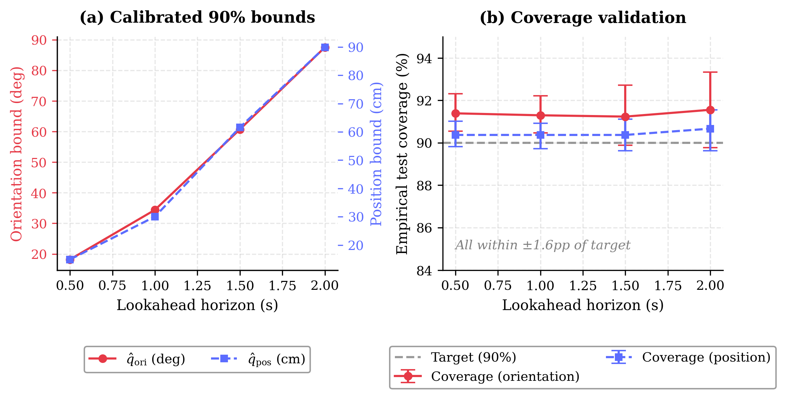
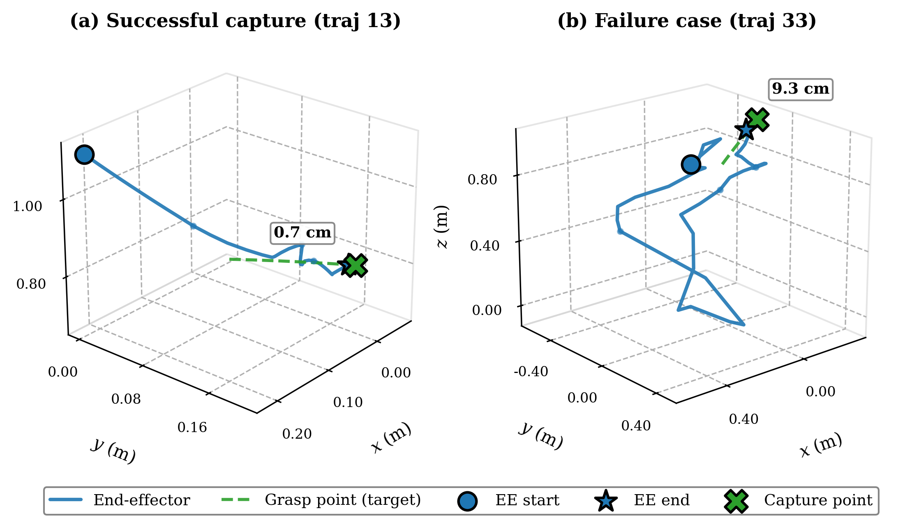
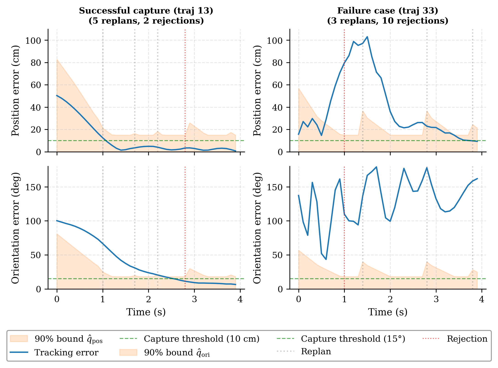

# conformal-capture

**Conformally Calibrated Motion Prediction for Adaptive Capture of Tumbling
Targets with a Free-Floating Manipulator**

Hadi Jahanshahi (hadij@yorku.ca) and Zheng Hong (George) Zhu
York University, Toronto, Canada

This repository reproduces every number, table, and figure in the paper: the
135-run two-arm benchmark, the hierarchical conformal calibration, the three
control mechanisms, the four ablation studies, and Figures 2-10. All
experiments are seeded; running the pipeline below with the shipped predictor
weights reproduces the published values exactly.

<p align="center">
  <br>
  <em>Calibrated 90% bounds versus lookahead horizon, with empirical test
  coverage and trajectory-level cluster-bootstrap intervals. Coverage stays
  within 90.4-91.6% across all horizons and both metrics.</em>
</p>

## What the system does

A physics-informed Uncertainty Propagation Network forecasts the tumbling
target's pose; a hierarchical split-conformal layer turns those forecasts into
distribution-free, finite-sample bounds; and the capture controller consumes
the bounds online through three mechanisms: replan rejection, smooth
orientation-gain modulation, and a rejection-overflow contingency.

<p align="center">
  <br>
  <em>End-effector and grasp-point paths for a successful capture (0.7 cm
  terminal error) and the benchmark's hardest run, where the contingency keeps
  the approach bounded at 9.3 cm despite a forecast that never becomes
  reliable.</em>
</p>

Across 135 closed-loop runs spanning tumble rates from 0.3 to 29.6 deg/s,
conformal adaptation improves the median rendezvous error from 4.84 to 4.04 cm
and from 7.22 to 4.02 deg, raises the capture-ready rate from 77% to 82%,
nearly doubles the strict-capture rate from 24% to 47%, and completes every run
without divergence.

<p align="center">
  <br>
  <em>Tracking errors against the calibrated envelope. Left: the successful run
  converges into the shrinking envelope. Right: the hardest run, where
  rejections accumulate and the contingency bounds the outcome into a
  diagnosable miss instead of a divergence.</em>
</p>

## Repository layout

```
cap_control/        chaser dynamics, controller, planner, UPN predictor
capture_lib_v2/     target dataset generator, shipped datasets, trained weights
scripts/            calibration, benchmark, ablation, and figure scripts
phase1_final/       original benchmark scripts the makers patch
paper_figures/      generated figures (Figures 2-10) and LaTeX tables
results/            expected_numbers.md lists every published value
reproduce_all.py    one-command orchestrator
check_env.py        environment diagnostic
```

## Requirements

Python 3.11 or newer. The controller depends on the companion library
**[space-robot-dq](https://github.com/HJahanshahi/space-robot-dq)**
(Jahanshahi and Zhu, 2026, *Front. Space Technol.* 7:1955127) for the
free-floating kinematics, the generalized Jacobian, and the momentum-conserving
base propagation. **Version 0.3.0 or newer is required**: earlier releases lack
the dynamics API (`compute_effective_arm_inertia`, `compute_coriolis_term`)
that the computed-torque controller uses.

```bash
git clone https://github.com/HJahanshahi/conformal-capture
cd conformal-capture
python -m venv .venv && source .venv/bin/activate   # Windows: .venv\Scripts\activate
pip install -r requirements.txt      # includes space-robot-dq >= 0.3.0
pip install -e .
python check_env.py                  # verifies the dynamics API is present
```

No GPU is required: the predictor runs on CPU throughout the benchmark.

## Exact reproduction

```bash
python reproduce_all.py                       # full pipeline
python reproduce_all.py --stage benchmark     # or any single stage
```

| stage | what it does | seeds |
|---|---|---|
| `datasets` | benchmark set (shipped, verified), calibration set, OOD set | 42 / 1000 / 2000 |
| `calibrate` | hierarchical repeated-subsampling calibration (Table 1) | B = 500 subsamples |
| `benchmark` | baseline and conformal arms, 45 trajectories x 3 seeds each | 1, 2, 3 |
| `ablations` | tau-schedule, out-of-distribution, exact-orientation-law | as in the paper |
| `figures` | Figures 2-10 and Tables 1-4 | deterministic |

Each stage runs a preflight check and writes its outputs to the repository
root and `paper_figures/`. Compare them against `results/expected_numbers.md`,
which lists every published value: headline metrics, per-bin medians, the
threshold grid, calibration constants, coverage, mechanism statistics, and the
ablation outcomes.

### What "exact" means

* The calibration, benchmark, coverage, and ablation stages are deterministic
  given the shipped datasets, the shipped weights, and the fixed seeds: they
  reproduce the paper's numbers exactly, not approximately.
* Retraining the predictor (`capture_lib_v2/scripts/02_train_upn_v3.py`)
  reproduces the results only approximately, because GPU training is not
  bit-deterministic across hardware. The shipped weights are the ones used in
  the paper.

## Key scripts

* `scripts/conformal_calibration_v2.py` - hierarchical grasp-point calibration
  (repeated subsampling, per-trajectory-maximum variant, cluster-bootstrap
  coverage); writes Table 1 and the Figure 2 inputs.
* `scripts/make_rerun_baseline.py`, `scripts/make_rerun_benchmark_v3.py` -
  build the two benchmark arms from the originals in `phase1_final/`.
* `scripts/make_tau_schedule.py` - builds the lookahead-schedule ablation.
* `scripts/ood_ablation.py` - out-of-distribution study at 30-50 deg/s, both
  arms plus a predictor-coverage probe.
* `scripts/c6_exact_xi.py` - exact orientation law (Jacobian-rate term) A/B
  comparison on a ten-run subset.
* `scripts/make_all_figures.py` - all figures and the four LaTeX tables.

## Citation

See `CITATION.cff`, or cite the article:

> Jahanshahi, H., and Zhu, Z. H. (2026). Conformally calibrated motion
> prediction for adaptive capture of tumbling targets with a free-floating
> manipulator. *Frontiers in Space Technologies*.

## License

MIT (see `LICENSE`). Contact: hadij@yorku.ca |
[github.com/HJahanshahi](https://github.com/HJahanshahi)
